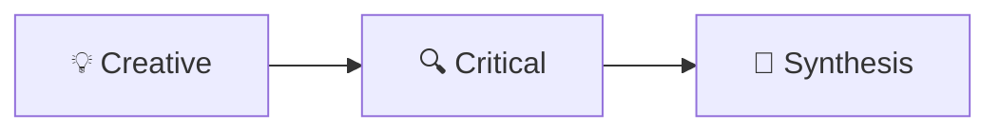
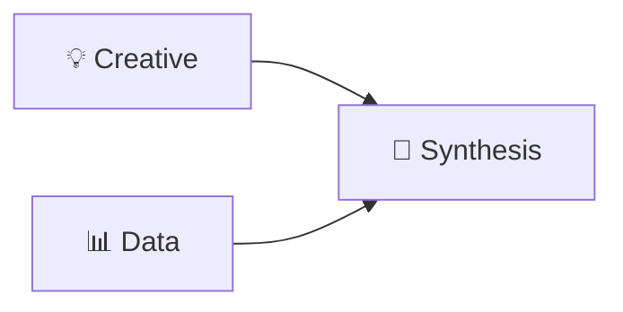
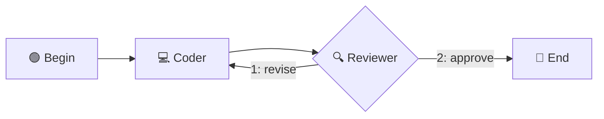

# Create OASIS Workflow YAML

> This document describes the OASIS workflow YAML format (Version 2 — Graph Mode) and how to create workflow schedules for TeamClaw teams. The format rules are extracted from the visual orchestrator prompt system.

---

## 1. Overview

OASIS workflows define how expert agents collaborate to solve tasks. A workflow is a directed graph where:
- **Nodes** (`plan`) represent expert steps, manual injections, or special control nodes (selectors)
- **Edges** define execution order — a node runs when all its incoming edges are satisfied
- **Conditional edges** enable branching based on runtime conditions
- **Selector edges** enable LLM-powered routing (the selector node chooses which branch to take)

All YAML schedules use **version: 2** with an explicit graph model.

---

## 2. YAML Format Rules (Version 2 — Graph Mode)

### 2.1 Basic Graph Structure

```yaml
version: 2
repeat: false
plan:
  - id: n1                        # Every node MUST have a unique id
    expert: "creative#temp#1"     # Stateless preset expert
  - id: n2
    expert: "critical#temp#1"
  - id: n3
    expert: "#oasis#agent_name"   # Stateful internal session agent (by name)
  - id: n4
    expert: "tag#oasis#agent_name" # Session agent with tag (tag→persona)
  - id: m1
    manual:
      author: "主持人"
      content: "Please summarize"

edges:                             # Fixed edges: always fire when source completes
  - [n1, n3]                       # n1 → n3
  - [n2, n3]                       # n2 → n3 (fan-in: n3 waits for BOTH n1 and n2)
  - [n3, n4]                       # n3 → n4
  - [n4, m1]                       # n4 → m1
```

### 2.2 Conditional Branching

```yaml
conditional_edges:
  - source: n3
    condition: "last_post_contains:APPROVED"
    then: n4                       # condition true → go to n4
    else: n2                       # condition false → loop back to n2
```

**Supported conditions:**
- `last_post_contains:<keyword>` — last message contains keyword
- `last_post_not_contains:<keyword>` — last message does not contain keyword
- `post_count_gte:<N>` — message count ≥ N
- `post_count_lt:<N>` — message count < N
- `always` — always true
- `!<expr>` — negate any expression

### 2.3 Selector Routing (LLM-powered Branching)

A selector node is an expert marked with `selector: true`. The LLM output determines which branch to take.

```yaml
plan:
  - id: router
    expert: "router_tag#temp#1"   # Selector can use any expert format (#temp#, #oasis#, etc.)
    selector: true                 # Mark as selector node

selector_edges:
  - source: router
    choices:
      1: branch_a                  # [oasis reply choose 1] → branch_a
      2: branch_b                  # [oasis reply choose 2] → branch_b
      3: __end__                   # [oasis reply choose 3] → end
```

### 2.4 Parallel Groups (within plan)

```yaml
plan:
  - id: brainstorm
    parallel:
      - expert: "creative#temp#1"
      - expert: "critical#temp#1"
```

### 2.5 All Experts

```yaml
plan:
  - id: discuss
    all_experts: true              # All experts speak simultaneously
```

---

## 3. Graph Rules

| Rule | Description |
|------|-------------|
| **Unique ID** | Every step MUST have a unique `id` field |
| **Edge-driven execution** | Edges define execution order; nodes with all incoming edges satisfied run in parallel automatically |
| **Entry points** | Nodes with no incoming edges are entry points (start immediately) |
| **Termination** | Use `__end__` as a target in edges to terminate the workflow |
| **Cycles** | The graph supports cycles via conditional/selector edges (for loops and debates) |
| **Fan-in** | A node with multiple incoming edges waits for ALL predecessors to complete |
| **Fan-out** | A node with multiple outgoing edges triggers ALL successors |

---

## 4. Expert Name Formats

Expert names follow a `tag#mode#identifier` convention:

| Format | Mode | Description | Example |
|--------|------|-------------|---------|
| `tag#temp#N` | Stateless | Preset expert instance N (no memory) | `creative#temp#1` |
| `tag#oasis#new` | Stateful | Auto-create new session for this expert | `critical#oasis#new` |
| `tag#oasis#name` | Stateful | Internal session agent by name (tag enables persona lookup) | `architect#oasis#my_architect` |
| `#oasis#name` | Stateful | Internal session agent by name (no tag) | `#oasis#test1` |
| `tag#ext#id` | External | External ACP agent | `openclaw#ext#Alice` |

### 4.1 Stateless vs Stateful

- **Stateless** (`#temp#`): Lightweight, no memory between rounds. Suitable for debates, brainstorming, and one-shot analysis.
- **Stateful** (`#oasis#`): Has memory and tools. The session persists across rounds, suitable for complex multi-step tasks.

### 4.2 External ACP Agents

For external ACP agents (tag = `openclaw`, `codex`, etc.), additional fields are required:

```yaml
- id: ext1
  expert: "openclaw#ext#my_agent"
  api_url: "http://127.0.0.1:23001"
  api_key: "****"
  model: "agent:my_agent"
```

**Session control via `model` field:**
- `model: "agent:<name>"` — session defaults to the **team name** (recommended)
- `model: "agent:<name>:<session>"` — explicit session, e.g. `"agent:test2:my-session"`

The `<name>` in model is ignored for routing (real name comes from `external_agents.json` `global_name`).  
Session determines conversation isolation: same session = shared context, different session = separate context.

---

## 5. Available Step Types

All step types require an `id` field.

| Step Type | Key | Description |
|-----------|-----|-------------|
| Expert | `expert: "name"` | Single expert speaks |
| Parallel | `parallel: [...]` | Multiple experts speak simultaneously |
| All Experts | `all_experts: true` | Everyone speaks at once |
| Manual | `manual: {author, content}` | Inject fixed text (no LLM call) |
| Selector | `selector: true` + `expert` | LLM-powered routing node (any expert format) |

### 5.1 Manual Nodes — Special Authors

Manual nodes support special `author` values for workflow control:

| Author | Purpose |
|--------|---------|
| `begin` | Marks the workflow start point |
| `bend` | Marks the workflow end point |
| Custom string | Displays as the speaker name (e.g., `"主持人"`) |

```yaml
- id: start
  manual:
    author: begin
    content: "讨论开始"
- id: end
  manual:
    author: bend
    content: "讨论结束"
```

---

## 6. Complete Examples

### 6.1 Simple Sequential Pipeline

Three experts discuss in sequence:

```yaml
version: 2
repeat: false
plan:
  - id: n1
    expert: "creative#temp#1"
  - id: n2
    expert: "critical#temp#1"
  - id: n3
    expert: "synthesis#temp#1"
edges:
  - [n1, n2]
  - [n2, n3]
```



### 6.2 Fan-in Parallel → Merge

Two experts work in parallel, then a synthesizer merges their outputs:

```yaml
version: 2
repeat: false
plan:
  - id: creative
    expert: "creative#temp#1"
  - id: data
    expert: "data#temp#1"
  - id: merge
    expert: "synthesis#temp#1"
edges:
  - [creative, merge]
  - [data, merge]
```



### 6.3 Selector Loop with Exit

A reviewer checks work and decides to loop back or finish:

```yaml
version: 2
repeat: false
plan:
  - id: start
    manual:
      author: begin
      content: "开始代码审查"
  - id: coder
    expert: "coder#temp#1"
  - id: reviewer
    expert: "critical#temp#1"
    selector: true
  - id: done
    manual:
      author: bend
      content: "审查完成"
edges:
  - [start, coder]
  - [coder, reviewer]
selector_edges:
  - source: reviewer
    choices:
      1: coder       # needs revision → loop back
      2: done         # approved → end
```



### 6.4 Mixed Pipeline with External Agent

Combines internal experts, an external OpenClaw agent, and a selector:

```yaml
version: 2
repeat: false
plan:
  - id: begin
    manual:
      author: begin
      content: "讨论开始"
  - id: creative
    expert: "creative#temp#1"
  - id: synth
    expert: "synthesis#oasis#综合顾问"
  - id: arch
    expert: "architect#temp#1"
  - id: ext_agent
    expert: "openclaw#ext#my_new_agent"
    api_url: "http://127.0.0.1:23001"
    api_key: "****"
    model: "agent:my_new_agent"
  - id: selector
    expert: "selector#temp#1"
    selector: true
  - id: end
    manual:
      author: bend
      content: "讨论结束"
edges:
  - [begin, creative]
  - [creative, synth]
  - [synth, arch]
  - [arch, ext_agent]
  - [ext_agent, selector]
selector_edges:
  - source: selector
    choices:
      1: ext_agent    # continue discussion
      2: end          # finish
```

### 6.5 Conditional Branching

Route based on content of the last message:

```yaml
version: 2
repeat: false
plan:
  - id: analyzer
    expert: "data#temp#1"
  - id: approve_path
    expert: "synthesis#temp#1"
  - id: reject_path
    expert: "critical#temp#1"
edges:
  - [analyzer, approve_path]       # default edge (may be overridden by conditional)
conditional_edges:
  - source: analyzer
    condition: "last_post_contains:REJECT"
    then: reject_path
    else: approve_path
```

---

## 7. Settings Reference

| Field | Type | Default | Description |
|-------|------|---------|-------------|
| `version` | int | `2` | Must be `2` for graph mode |
| `repeat` | bool | `false` | `true` = repeat plan every round (debates), `false` = execute once (pipelines) |

---

## 8. Workflow File Location

Workflow YAML files are stored at: [[memory:s3bt8876]]

- **Team workflows**: `data/user_files/{user_id}/teams/{team}/oasis/yaml/*.yaml`
- **Public workflows**: `data/user_files/{user_id}/oasis/yaml/*.yaml`

### 8.1 Save via CLI

```bash
# Set a workflow for a team
uv run scripts/cli.py oasis set-workflow \
  --team <TEAM_NAME> \
  --name <WORKFLOW_NAME> \
  --file <PATH_TO_YAML>
```

### 8.2 Save via MCP Tool

The `set_oasis_workflow` MCP tool can be used to save a workflow:
- Provide a descriptive `name` (e.g., `code_review_pipeline`, `brainstorm_trio`)
- Provide the YAML content as string

---

## 9. Tips & Best Practices

1. **Maximize parallelism**: Nodes with no dependency relationship should run concurrently. Use fan-in/fan-out patterns.
2. **Use selectors for loops**: When you need iterative refinement, use a selector node to decide whether to loop or exit.
3. **Begin/End markers**: Use `manual` nodes with `author: begin` and `author: bend` to clearly mark workflow boundaries.
4. **Stateful for complex tasks**: Use `#oasis#` mode for experts that need memory across rounds (e.g., a coder maintaining context).
5. **Stateless for debates**: Use `#temp#` mode for lightweight discussion experts where memory is not needed.
6. **External agents for specialized work**: Use `#ext#` for delegating to other OpenClaw agents or external APIs with their own tools.
7. **Edge ordering**: Selector node outgoing edges should be defined in `selector_edges`, not in regular `edges`.
